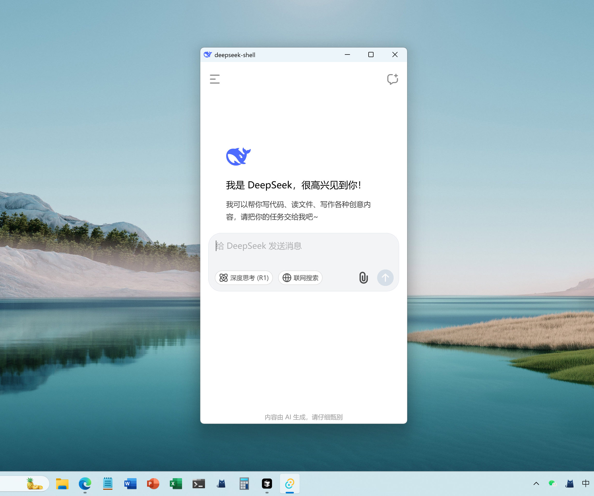

# DeepSeek 桌面端 （DeepSeek Desktop)


## 安装包与使用方式

- **下载地址**：[点击下载最新版安装包](https://gitee.com/xxdxxdxxd/deepseek-shell/releases/tag/v1.0.0)
- **安装方式**：

  1. 下载对应平台的安装包（Windows安装包已提供，macOS、Linux未提供，可自行编译）。
  2. 按照提示完成安装。
- **使用方式（请确保alt+space快捷键未被占用）**：

  1. 安装完成后，运行 Deepseek-Shell 桌面端。
  2. 可通过 `Alt+Space` 快捷键随时**唤出或隐藏**聊天窗口。
  3. 关闭窗口后自动收至系统托盘处。
  4. 托盘右键点击可设置开机启动。
  5. 登录你的 Deepseek 账户，即可开始与 AI 对话。

---

## 项目简介

**Deepseek桌面端（DeepSeek-Shell）** 是一个极简、高效、极小体积（仅约 8MB）的 DeepSeek套壳桌面端应用。灵感来源于豆包桌面端的便捷体验，用户可通过 `Alt+Space` 快捷键随时唤出一个小巧的聊天窗口，快速与 Deepseek Chat 进行对话。

本项目基于 [Tauri](https://tauri.app/) + [Vite](https://vitejs.dev/) 构建，具备以下特点：

- **极小体积**：安装包仅约 8MB，资源占用极低，下载和启动都非常迅速。
- **极简桌面端**：安装后可通过快捷键呼出，无需切换窗口，随时随地提问。
- **Deepseek 能力**：直接调用 Deepseek Chat 网页端的强大 AI 能力，支持原生账户登录。
- **UI 适配**：专为小窗口场景设计，界面简洁，交互高效。
- **系统托盘支持**：支持最小化到系统托盘、托盘菜单等，便于后台常驻和快速访问。
- **跨平台支持**：支持 Windows、macOS、Linux 多平台。
- **安全可靠**：本地壳与 Deepseek 官方服务对接，无需担心数据安全。

本项目目标是为 Deepseek 用户带来如豆包桌面端般的便捷体验，但拥有更强大的 AI 能力、更优的界面适配和极小的体积。



---


## 1. 安装依赖

在项目根目录下运行（只需一次）：

```bash
npm install
```

---

## 2. 启动开发模式

开发时，Tauri 会自动启动前端和桌面端，支持热重载。

```bash
npm run tauri dev
```

- 这会打开一个桌面窗口，实时预览前端页面。
- 可以在 `src/` 里开发前端页面，`src-tauri/` 里开发 Rust 后端。

---

## 3. 运行前端（仅网页预览）

如果只想预览前端页面（不启动桌面端）：

```bash
npm run dev
```

- 这会用 Vite 启动本地开发服务器，通常访问 http://localhost:5173。

---

## 4. 打包发布

打包成可分发的桌面应用（.exe、.dmg、.AppImage等）：

```bash
npm run tauri build
```

- 生成的安装包在 `src-tauri/target/release/bundle/` 目录下。
- Windows 下会有 `.msi` 或 `.exe` 安装包。

---

## 5. 其他常用命令

- **清理构建缓存**
  ```bash
  npm run tauri clean
  ```
- **升级 Tauri 依赖**
  ```bash
  npm update
  ```

---

## 6. 常见问题

- **首次运行报错**：确保已安装 Rust 环境（Tauri 需要），可用 [Rust 官网](https://www.rust-lang.org/tools/install) 安装。
- **Windows 下依赖**：建议安装 [Visual Studio Build Tools](https://visualstudio.microsoft.com/visual-cpp-build-tools/)。

---

## 7. 官方文档

- [Tauri 官方文档](https://tauri.app/v1/guides/getting-started/prerequisites/)
- [Vite 官方文档](https://vitejs.dev/guide/)
